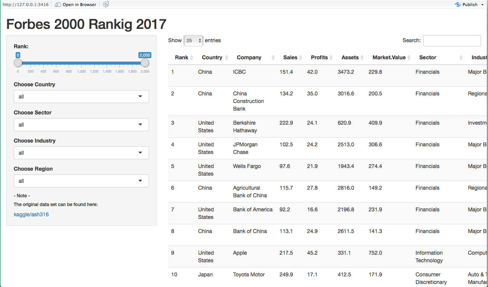
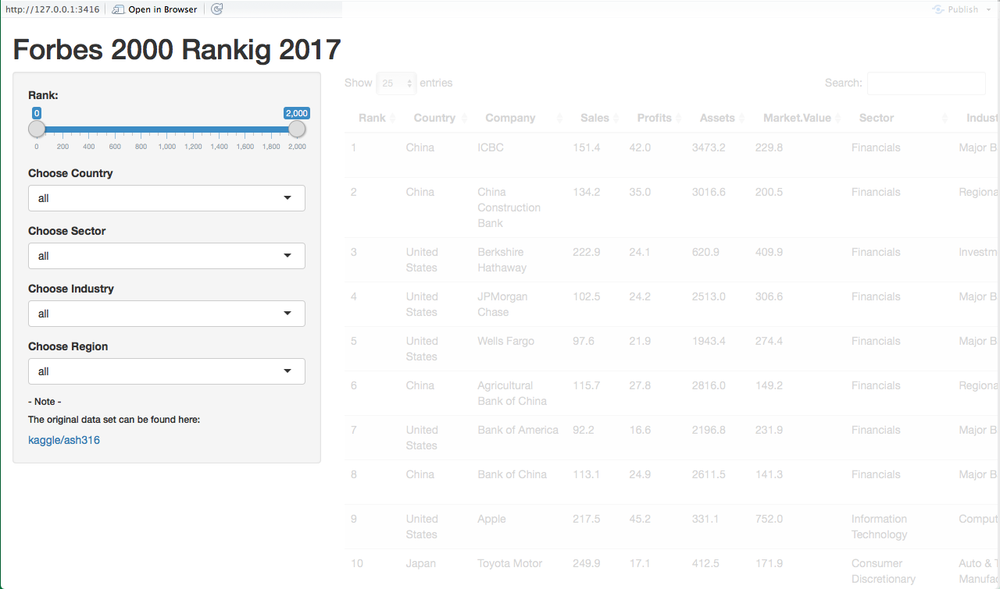
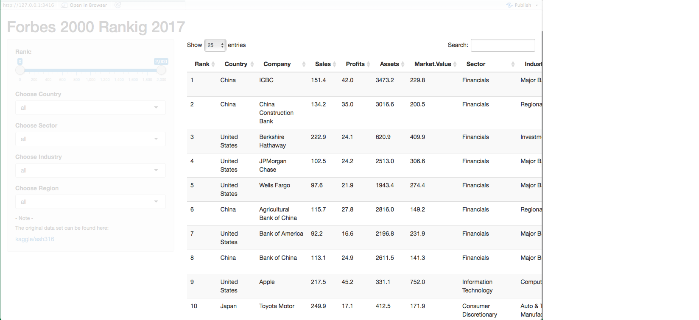

# Introduction

##**Visualizing the Forbes Global 2000 dataset from 2017**

This App aims to provide a handling data visualisation for 
*Forbes Global 2000* dataset from 2017 as part of the Data Products Course in the Data Science Specialization
from the [Johns Hopkins University](http://www.jhu.edu) in [Coursera](https://www.coursera.org/specializations/jhu-data-science).

The dataset was downloaded from [kaggle](https://www.kaggle.com/ash316/forbes-top-2000-companies).

The Forbes Global 2000 dataset 2017
========================================================

The columns displayed are:

  - **Rank**          - Rank number    
  - **Country**       - Company's Country   
  - **Company**       - Company's name 
  - **Sales**         - in Billions USD
  - **Profits**        in Billions USD
  - **Assets**      - in Billions USD
  - **Market.Value**  - Market Value in billions USD
  - **Sector**        - Description of the Sector
  - **Industry**      - Description of the Industry
  - **Return**        - Ratio Profits/Sales in %

The Forbes Global 2000 dataset 2017
========================================================
The Forbes2000 2017 dataset from [kaggle](https://www.kaggle.com/ash316/forbes-top-2000-companies)
contains the world’s biggest 2000 public companies.

The columns displayed are:

  - **IncomeGroup**      - Country's Income Group from the World Bank
  - **Region**  - as assigned by the World Bank
  
The last three columns **Return**, **IncomeGroup** and **Region** were added to the original dataset by me.

The information **IncomeGroup** and **Region** was extracted from the [World Bank](http://databank.worldbank.org/data/home.aspx).

Overall layout
========================================================

Overall layout
========================================================
left: 30%
- **Sidebar** 

*Slider button for Ranking interval* 

*Selection filters for*

  - Country
  - Region
  - Sector
  - Industry
  
***

  
  
  
  Overall layout
========================================================
 - **Main**

  The reactive table displying the filtered data.

***

  Thank you!
========================================================

