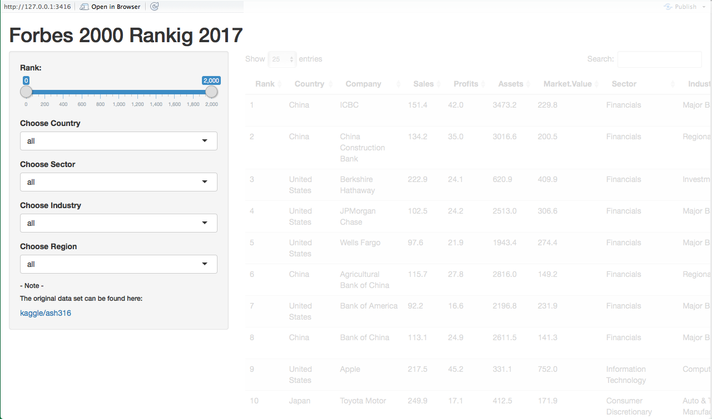
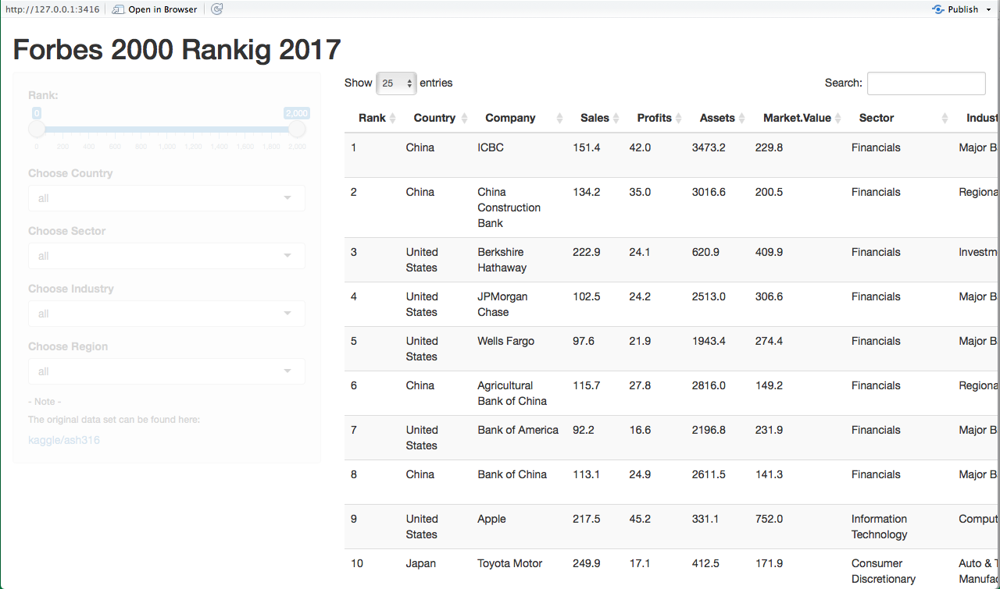

## Introduction

`Visualizing the Forbes Global 2000 dataset from 2017`


This App aims to provide a handling data visualization for 
*Forbes Global 2000* dataset from 2017 as part of the Data Products Course in the Data Science Specialization
from the [Johns Hopkins University](http://www.jhu.edu) in [Coursera](https://www.coursera.org/specializations/jhu-data-science).

The dataset was downloaded from [kaggle](https://www.kaggle.com/ash316/forbes-top-2000-companies).

---


## The Forbes Global 2000 dataset 2017 - Columns
```{r}
data<-read.csv("Forbes2000_2017_WorldBank.csv")
str(data,vec.len = 2)
```
  - `Rank`          - Rank number             
  - `Country`       - Company's Country   
  - `Company`       - Company's name 
  - `Sales`         - in Billions USD
  - `Profits`        in Billions USD
  - `Assets`      - in Billions USD
  - `Market.Value`  - Market Value in billions USD
  - `Sector`        - Description of the Sector
  - `Industry`      - Description of the Industry
  - `Return`        - Ratio Profits/Sales in %
  - `IncomeGroup`   - Country's Income Group from the World Bank
  - `Region`        - as assigned by the World Bank

<!-- The information **IncomeGroup** and **Region** was extracted from the [World Bank](http://databank.worldbank.org/data/home.aspx). -->

---
##  Overall layout

<div style='text-align: center;'>
    
</div>

`Sidebar with Filters for`

- Rank interval - Country - Region - Sector - Industry

---
##  Overall layout

<div style='text-align: center;'>
    
</div>

`Main` 

Displaying the reactive data table with your filtered information

Thank you!


